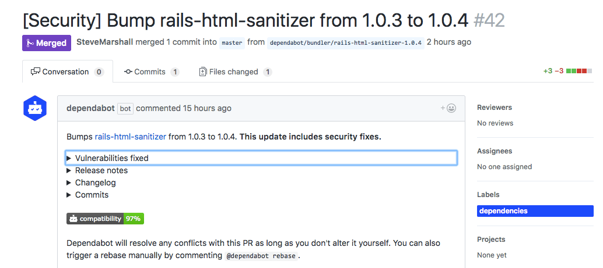

GitHub announced the [GitHub Security Advisory API][github-announcement] today
at GitHub Universe. Dependabot now uses it to pull in additional security
vulnerability details.

  

Dependabot has [automatically responded to security advisories][automatically-respond-to-security-advisories]
since April, and using GitHub's vulnerability alerts database as a source since
[July][github-security-alerts-original]. Whenever a new vulnerability is
announced we immediately open PRs to update all Dependabot users to secure
versions.

GitHub's new Security Alerts API gives us more data about the vulnerabilities
we're helping to protect you from, and makes the information available to us in
real time. That means you can now expect a Dependabot PR to fix any security
vulnerabilities seconds after they're published to GitHub's database.

Stay safe out there!

🕵️‍♀️

[github-announcement]: https://blog.github.com/category/announcements/#github-security-advisory-api
[automatically-respond-to-security-advisories]: ../automatically-respond-to-security-advisories
[github-security-alerts-original]: ../github-security-alerts
